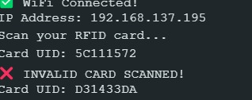
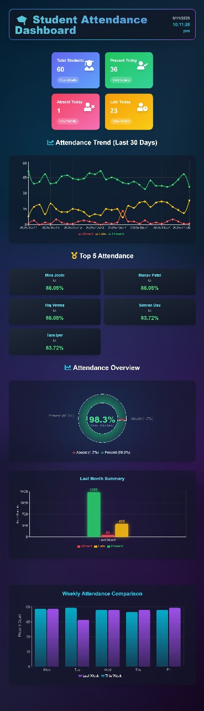

🎓 RFID-Based Smart Attendance System
A **full-stack IoT attendance management system** using **ESP32 + RFID RC522 + React + PHP + MySQL**, featuring real-time logging, analytics dashboard, and automatic email notifications.

🚀 Overview

This RFID-based attendance system automates attendance tracking using RFID cards and IoT technology.  
When an RFID tag is scanned, the **ESP32 microcontroller** sends the data to a **PHP-MySQL backend**, which stores the attendance record and triggers an **email notification**.  
A modern **React.js dashboard** visualizes the data with insights and trends.

Designed to showcase skills in:
- Embedded development (ESP32 + RFID RC522)
- Backend integration with PHP APIs and MySQL
- Frontend dashboard using React.js
- Full IoT-to-Web workflow

🧠 Tech Stack

| Layer | Technology |
|-------|-------------|
| **Hardware** | ESP32, RFID RC522 |
| **Frontend** | React.js |
| **Backend** | PHP (XAMPP) |
| **Database** | MySQL |
| **Email Service** | PHPMailer |
| **Communication** | HTTP via Wi-Fi |

⚙️ Core Features

- ✅ **RFID-Based Attendance Logging** — Automated card-based entry system.
- 📡 **ESP32 to Server Communication** — Sends UID and timestamps via HTTP.
- ✉️ **Mail Notifications** — Uses PHPMailer for instant student notifications.
- 📊 **React.js Dashboard** — Displays statistics, charts, and logs dynamically.
- 🔒 **Secure Verification** — Rejects invalid RFID cards.
- ⏱ **Real-Time Insights** — Track attendance daily, weekly, and monthly.

## 🖼️ Screenshots

RFID Scanning (Valid & Invalid)

Dashboard

🔌 How It Works

1. **ESP32 Setup** — Connects to Wi-Fi and waits for RFID scans.  
2. **RFID Scan** — Reads UID, sends it to PHP server endpoint.  
3. **Server Processing (PHP)** — Validates card, logs attendance, sends email.  
4. **Dashboard Display (React)** — Fetches and visualizes data through API calls.

📧 Sample Email Notification

Subject: Attendance Recorded

Hello [Student Name],
Your attendance has been successfully marked today.

Best Regards,
RFID Attendance System

🧩 Installation Guide

1️⃣ Backend (PHP + MySQL)
1. Install **XAMPP**.
2. Move this project folder to `C:\xampp\htdocs\`.
3. Create a MySQL database `rfid_attendance_system`.
4. Import `attendance.sql` into phpMyAdmin.
5. Start **Apache** and **MySQL** in XAMPP.

2️⃣ ESP32 Setup
1. Open `.ino` file in Arduino IDE.  
2. Install libraries:
   - `WiFi.h`
   - `SPI.h`
   - `MFRC522.h`
3. Update `ssid`, `password`, and server URL.  (ESP32 works at 2.4GHz, 5GHz will noy connect to the wifi)
4. Upload code to ESP32 and connect RFID module.

3️⃣ Frontend (React.js)

cd rfid-dashboard
npm install
npm start
Access the dashboard at http://localhost:3000

🌟 Future Enhancements
🔐 Admin login for secure access

📄 Export attendance to PDF/CSV

☁️ Cloud-hosted backend (AWS or Firebase)

📱 Mobile-responsive dashboard

👩‍💻 Developer
👤 Sunidhi Mallah
📍 IoT & Full-Stack Developer | Smart Systems & Automation Enthusiast
🌐 GitHub Profile

🏁 Summary
This RFID-based system demonstrates a seamless integration of hardware, backend, and frontend — a real-world IoT product pipeline.
It’s an excellent example of practical automation and data-driven web integration using modern tools.
